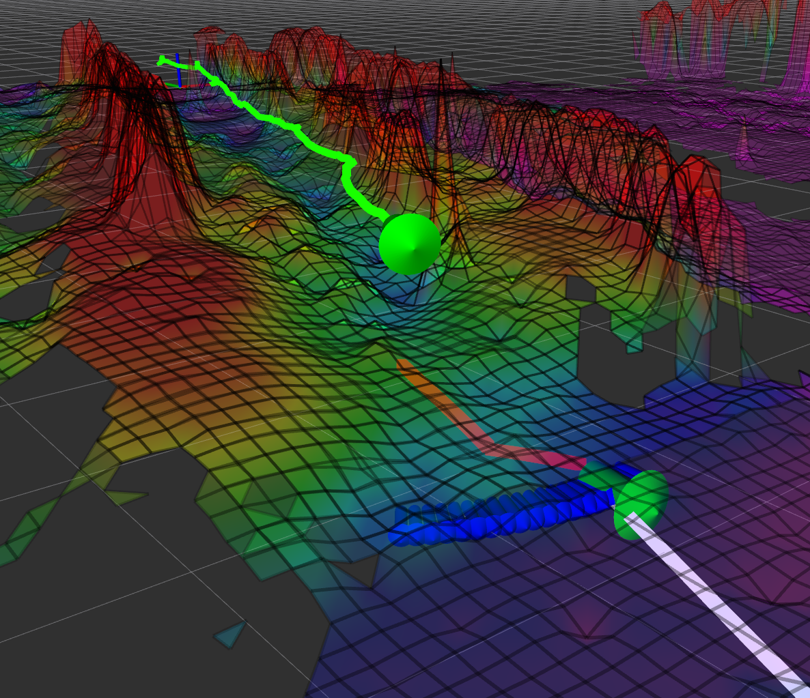
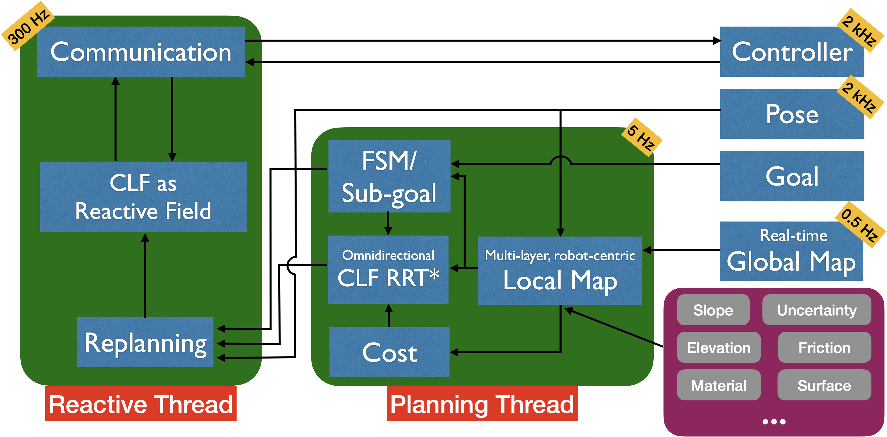
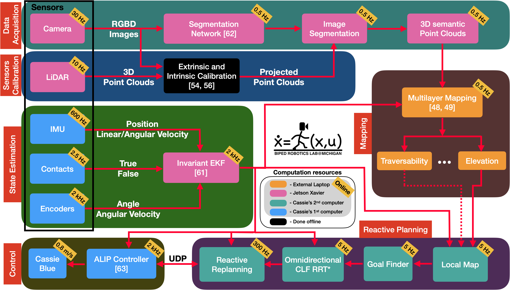
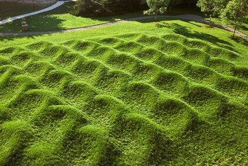

# CLF_reactive_planning_system 

## Overview
This package provides a CLF-based reactive planning system, described in the paper: **Efficient Anytime CLF Reactive Planning System for a Bipedal Robot on Undulating Terrain** ([PDF](./Reactive_CLF_Planning_System.pdf))([arXiv](https://arxiv.org/abs/2108.06699)). The reactive planning system consists of a 5-Hz planning thread to guide a robot to a distant goal and a 300-Hz Control-Lyapunov-Function-based (CLF-based) reactive thread to cope with robot deviations.  The planning system allowed Cassie Blue to autonomously traverse sinusoidally varying terrain. More experiments are still being conducted and this repo and the paper will be updated accordingly.


* Author: Jiunn-Kai (Bruce) Huang and Jessy W. Grizzle
* Maintainer: [Bruce JK Huang](https://www.brucerobot.com/), brucejkh[at]gmail.com
* Affiliation: [The Biped Lab](https://www.biped.solutions/), the University of Michigan

This package has been tested under [ROS] Melodic and Ubuntu 18.04.\
**[Note]** More detailed introduction will be updated shortly. Sorry for the inconvenient!\
**[Issues]** If you encounter _any_ issues, I would be happy to help. If you cannot find a related one in the existing issues, please open a new one. I will try my best to help!


## Abstract
We propose and experimentally demonstrate a reactive planning system for bipedal robots on unexplored, challenging terrains. The system consists of a low-frequency planning thread (5 Hz) to find an asymptotically optimal path and a high-frequency reactive thread (300 Hz) to accommodate robot deviation. The planning thread includes: a multi-layer local map to compute traversability for the robot on the terrain; an anytime omnidirectional Control Lyapunov Function (CLF) for use with a Rapidly Exploring Random Tree Star (RRT\*) that generates a vector field for specifying motion between nodes; a sub-goal finder when the final goal is outside of the current map; and a finite-state machine to handle high-level mission decisions. The system also includes a reactive thread to obviate the non-smooth motions that arise with traditional RRT\* algorithms when performing path following. The reactive thread copes with robot deviation while eliminating non-smooth motions via a vector field (defined by a closed-loop feedback policy) that provides real-time control commands to the robot's gait controller as a function of instantaneous robot pose. The system is evaluated on various challenging outdoor terrains and cluttered indoor scenes in both simulation and experiment on Cassie Blue, a bipedal robot with 20 degrees of freedom. All implementations are coded in C++ with the Robot Operating System (ROS) and are available at https://github.com/UMich-BipedLab/CLF_reactive_planning_system.


## Video
Please checkout the introduction [video](https://www.brucerobot.com/clf-reactive-planning). It highlights some important keypoints in the paper!
[](https://www.brucerobot.com/clf-reactive-planning)


## Quick View
Cassie Blue autonomously traverses the Wave Field via the proposed reactive planning system. More Cassie experiments are still being conducted. More images will be updated!





## What does This *Reactive Planning System* Contain?
This reactive planning system consists of a low-frequency (5 Hz) planning thread and a high-frequency (300 Hz) *reactive* thread ([see here](#What-is-Reactive-and-Why)). The planning thread involves a multi-layer local map to compute traversability, a sub-goal finder, and an omnidirectional Control Lyapunov Function RRT\*. Instead of a common waypoint-following or path-tracking strategy, the reactive thread copes with robot deviation while eliminating non-smooth motions via a vector field (defined by a closed-loop feedback policy) that provides real-time control commands to the robot's gait controller as a function of instantaneous robot pose.



## What is Reactive and Why
A reactive planning replaces the concept of trajectory with a vector field arising as the gradient of a potential function. Therefore, instead of a common waypoint-following or path-tracking strategy, the reactive thread copes with robot deviation while eliminating non-smooth motions via a vector field (defined by a closed-loop feedback policy) that provides real-time control commands to the robot's gait controller as a function of instantaneous robot pose. In other words, the reactive planner **automatically** adjusts the control commands to handle any deviations the robot may incur!


## Overall Pipeline for Autonomy
Illustration of how the various processes in the overall autonomy system are distributed and their computation frequencies. The larger boxes indicate various modules such as Data Acquisition, Planning, and Control. The smaller boxes are colored according to the processor that runs them.




## Results
Both simulation and experimental results are provided. All the followings results are shown as GIFs, which are generated by extracting 300 frames from the original videos and then are played back by 10 FPS. The real videos with 1x speed can be found at [here](https://www.brucerobot.com/clf-reactive-planning).


### Experimental Results
More experiments are still being conducted! More visual will be added soon.


#### Cassie Blue on Undulating Terrain 
The experimental terrain is the Wave Field is located on the North Campus of the University of Michigan. The Wave Field consists of sinusoidal humps with a depth of approximately 1.5 m from the bottom of the valleys to the crest of the humps; there is a second sinusoidal pattern running orthogonal to the main pattern, which adds 25 cm ripples peak-to-peak even in the valleys.

##### Wave Field on the North Campus of the University of Michigan



### Simulation Results of an ALIP Model Robot on the Wave Field 
The simulated robot is based on the ALIP model and accepts piece-wise constant inputs at the beginning of each step. The highlighted areas show the local maps being provided to the robot. 


### Simulation Results of an ALIP Model Robot in Synthetic, Noise, and Patchy Maps  
The simulated robot is based on the ALIP model and accepts piece-wise constant inputs at the beginning of each step. The highlighted areas show the local maps being provided to the robot. 

#### -- cluttered indoor scenes with obstacles and holes 


#### -- noisy undulating outdoor terrains 


#### -- high-level missions


### Simulation Results of a Whole-body Cassie Simulator in a Perfect Map
To ensure the control commands from the reactive planning system are feasible for Cassie-series bipedal robots, we sent the commands via User Datagram Protocol (UDP) from ROS C++ to Matlab-Simmechanics, which simulates a 20 DoF of Cassie, using footfalls on the specified terrain. The simulator then sent back the pose of the simulated Cassie robot to the planning system to plan for the optimal path via UDP. The planner system successfully took the simulated Cassie to the goal without falling!


## Required Libraries / Packages
1. Please install [ROS Melodic](http://wiki.ros.org/melodic/Installation/Ubuntu).
2. Please install [this package](https://github.com/UMich-BipedLab/CLF_reactive_planning_system). 
3. Please install [planner_msgs](https://github.com/UMich-BipedLab/planner_msgs). 
4. Please install [grid_map](https://github.com/UMich-BipedLab/customized_grid_map). 


The structure should be
catkin  
└── src  
&nbsp;   &nbsp;   &nbsp;   &nbsp;   &nbsp;├── CLF_reactive_planning_system (This package)  
&nbsp;   &nbsp;   &nbsp;   &nbsp;   &nbsp;├── planner_msgs  
&nbsp;   &nbsp;   &nbsp;   &nbsp;   &nbsp;└── customized_grid_map   


## Datasets
All the datasets (bagfiles) are available on Google Drive: please download them [here](https://drive.google.com/drive/folders/1cBq0YR_KqXNcOZA21D_SFxpViMAUgyle?usp=sharing)


## Running
### Using provided bagfiles:
1. Please download at least one bagfile from [here](https://drive.google.com/drive/folders/1cBq0YR_KqXNcOZA21D_SFxpViMAUgyle?usp=sharing).
2. `catkin_make` the package in the _catkin_ folder.
3. `source devel/setup.bash`
4. `roslaunch cassie_planning fake_robot.launch`
5. `roslaunch cassie_planning wavefield.launch`
6. `rosbag play -l -q bagfile.bag`
7. To see the results, `rosrun rviz rviz`. You can directly open _wavefield.rviz_ under the _CLF_reactive_planning_system/rviz/_ folder.

### Onboard processing:
1. `catkin_make` the package in the _catkin_ folder.
2. `source devel/setup.bash`
3. `roslaunch cassie_planning wavefield.launch`
     - ensure you have robot pose and map information published 
4. To see the results, `rosrun rviz rviz`. You can directly open _wavefield.rviz_ under the _CLF_reactive_planning_system/rviz/_ folder.

###### Note: More detailed explanation about how to use configuration files (\*.yaml) with launch files will come soon.

## Citations
The detail is described in: **Efficient Anytime CLF Reactive Planning System for a Bipedal Robot on Undulating Terrain,** Jiunn-Kai Huang and Jessy W. Grizzle. ([PDF](./Reactive_CLF_Planning_System.pdf)) ([arXiv](https://arxiv.org/abs/2108.06699)) 

```
@article{huang2021efficient,
      title={{Efficient Anytime CLF Reactive Planning System for a Bipedal Robot on Undulating Terrain},
      author={Jiunn-Kai Huang and Jessy W. Grizzle}},
      year={2021},
      journal={arXiv preprint arXiv:2108.06699},
      primaryClass={cs.RO}
}
```

